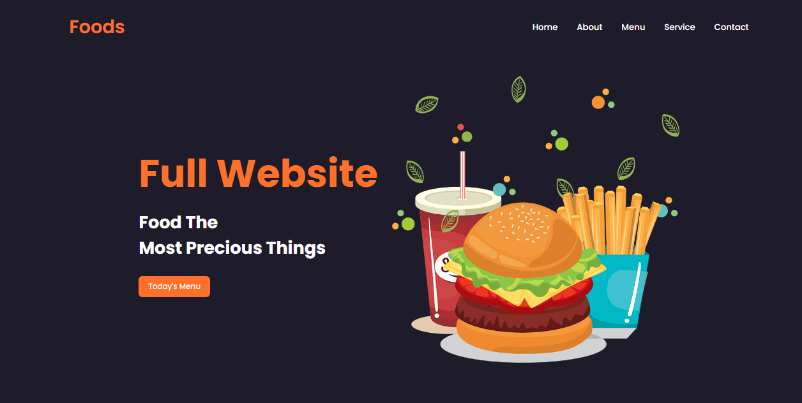

<h1>🔠Foods Website </h1>

<a href="https://thunderous-sherbet-ee816b.netlify.app/">Clique nesse link para acessar o projeto</a>

<h2>💻 Tecnologias</h2>
<ul>
<li>HTML</li>
<li>CSS</li>
<li>JAVASCRIPT</li>
<li>GIT</li>
<li>GITHUB</li>
</ul>